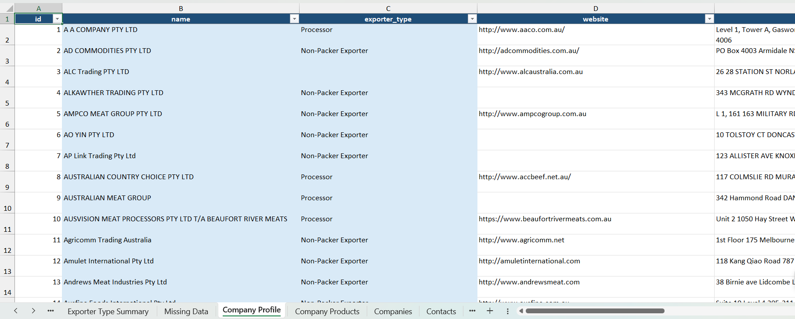

## Quick Start

➡ Run `run_pipeline_windows.bat` and open `data/exporters.xlsx`

# Exporter Intelligence Pipeline

## Overview

This project builds a structured dataset of exporters, including:

- Company profiles
- Products and categories
- Certifications and accreditations
- Contact details

The output is delivered as an Excel workbook designed for analysis and filtering.

---

## Why this matters

This tool provides a quick way to:

- Identify potential competitors
- Find suppliers and partners
- Filter exporters by product type
- Compare certifications and capabilities
- Identify gaps in the market

---

## Outputs

### Example Output

### 1. Excel Workbook
`exporters_master.xlsx`

Key sheets:

- **Company Profile** – overview of each exporter
- **Company Products** – product families and variants
- **Contacts** – emails and phone numbers where available
- **Product Summary** – distribution of exporters by product
- **Certification Summary** – certification landscape
- **Missing Data** – highlights gaps in the dataset

---

### 2. Database Schema
- `exporters_final_schema.sql`
- `exporters_schema.md`

Defines how the dataset is structured internally.

---

## How to use

### Option 1 — Easy (recommended)

1. Double-click `run_pipeline.bat`
2. Wait for:
  
